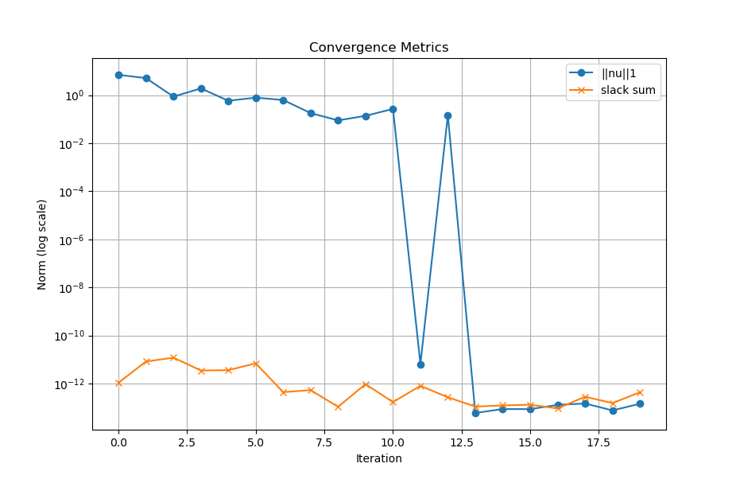
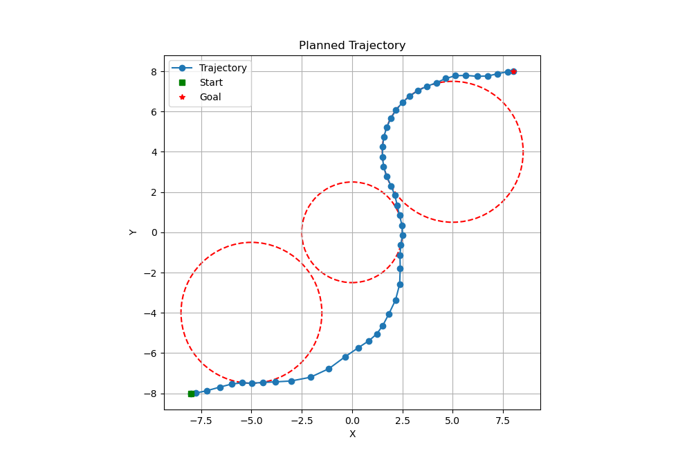
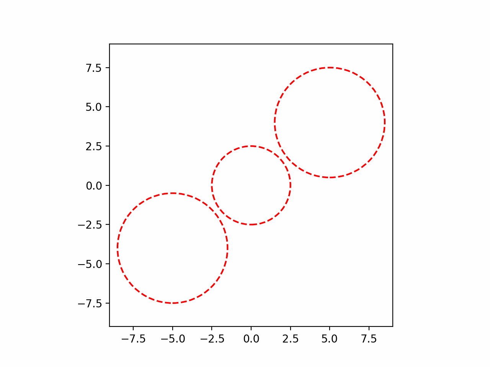

# 1. Introduction

## 1.1 Motivation for Trajectory Optimization

Trajectory optimization plays a central role in planning and control for autonomous systems, particularly when operating in environments with constraints, nonlinear dynamics, or objectives involving efficiency, safety, or agility. In robotic motion planning, achieving smooth, dynamically feasible trajectories that avoid obstacles and respect physical limitations is essential for real-world deployment. Traditional optimal control methods often struggle with convergence and scalability when dealing with nonlinear dynamics and nonconvex constraints. This motivates the use of structured iterative algorithms that can leverage convex approximations to reliably solve such problems.

## 1.2 Overview of Successive Convexification (SCvx)

Successive Convexification (SCvx) is an iterative optimization method designed to solve nonconvex trajectory optimization problems by sequentially solving convex subproblems. At each iteration, the original nonlinear and nonconvex dynamics are linearized around a reference trajectory using first-order approximations. The resulting linear dynamics, along with convexified constraints, form a subproblem that can be efficiently solved using convex optimization techniques. SCvx incorporates trust region mechanisms to ensure global convergence and robustness against poor linearization. It penalizes defects (i.e., violations of dynamics due to linearization errors) and slack variables introduced to handle constraint relaxation, guiding the solution toward feasible, optimal trajectories.

## 1.3 Application to Unicycle Model

In this work, we apply the SCvx framework to the trajectory optimization problem for a unicycle model, a commonly used abstraction for mobile robots. The unicycle system is characterized by nonlinear, nonholonomic dynamics that make direct optimization challenging. Our implementation demonstrates how SCvx can be used to generate smooth, obstacle-avoiding trajectories from an initial state to a target pose, while satisfying bounds on velocity and angular rate. The optimization incorporates discretization via First-Order Hold (FOH), trust region adaptation, and symbolic Jacobian computation, and is structured to support modular extension to more complex models.

# 2. Problem Formulation

## 2.1 System Dynamics
### 2.1.1 State and Control Definitions
We consider a unicycle model where the system’s state vector is defined as
```math
x = \begin{bmatrix} x \\ y \\ \theta \end{bmatrix} \in \mathbb{R}^3,
```

representing the 2D position $(x, y)$ and heading angle $\theta$. The control input is
```math
u = \begin{bmatrix} v \\ \omega \end{bmatrix} \in \mathbb{R}^2,
```
where $v$ is the forward linear velocity and $\omega$ is the angular velocity.

### 2.1.2 Continuous-Time Dynamics

The nonlinear, continuous-time dynamics of the unicycle model are given by:
$$
\dot{x} = f(x, u) = \begin{bmatrix} v \cos\theta \\ v \sin\theta \\ \omega \end{bmatrix}.
$$
This model captures nonholonomic motion, as the vehicle can only move in the direction of its heading.

### 2.1.3 Jacobian Linearization

To facilitate convex optimization, we linearize the dynamics about a nominal trajectory using first-order Taylor expansion. The Jacobians are:
- With respect to state:
```math
A(x, u) = \frac{\partial f}{\partial x} = \begin{bmatrix}
0 & 0 & -v \sin\theta \\
0 & 0 &  v \cos\theta \\
0 & 0 & 0
\end{bmatrix},
```
- With respect to input:
```math
B(x, u) = \frac{\partial f}{\partial u} = \begin{bmatrix}
\cos\theta & 0 \\
\sin\theta & 0 \\
0 & 1
\end{bmatrix}.
```

## 2.2 Optimization Objective

### 2.2.1 Control Effort and Time Minimization

The objective is to minimize both control effort and total traversal time. The total cost includes:
- A term penalizing the $L_1$ norm of the defect variables $\nu_k$, which quantify deviations from the dynamics due to linearization.
- A term penalizing the final time scaling $\sigma$ to encourage time efficiency.

### 2.2.2 Obstacle Avoidance via Slack Variables

To ensure safe trajectories around obstacles, we introduce slack variables $s_k^{(j)}$ for each obstacle $j$ at time step $k$. These slack variables allow soft constraint violations, which are heavily penalized in the cost function:
```math
J_{\text{slack}} = \sum_{j=1}^{N_{\text{obs}}} \sum_{k=1}^{K} s_k^{(j)}.
```

## 2.3 Constraints

### 2.3.1 Boundary Conditions

The trajectory is constrained to start at a predefined initial state $x_0$ and end at a desired final state $x_K$:
```math
x_0 = x_{\text{init}}, \quad x_K = x_{\text{final}}, \quad u_0 = u_K = 0.
```
### 2.3.2 Input Bounds

The input constraints reflect physical actuator limits:
- Linear velocity: $0 \leq v_k \leq v_{\text{max}}$
- Angular velocity: $|\omega_k| \leq \omega_{\text{max}}$

### 2.3.3 Obstacle Avoidance Constraints

Obstacles are modeled as circular regions. At each time step $k$, the linearized constraint for avoiding obstacle $j$ centered at $p_j$ with radius $r_j$ (including the robot radius) is:
```math
a_k^{(j)T} (x_k^{\text{pos}} - p_j) \geq r_j + r_{\text{robot}} - s_k^{(j)},
```
where $a_k^{(j)}$ is a normalized vector pointing away from the obstacle, linearized at the previous iterate.

# SCvx Algorithm Overview

The Successive Convexification (SCvx) method solves non-convex trajectory optimization problems by iteratively approximating them with convex subproblems. At each iteration, the nonlinear dynamics and constraints are linearized around the current trajectory, and a convex program is solved within a trust region to ensure the validity of the linear approximation.

## 3.1 Trust Region Update Mechanism

To ensure convergence and prevent large, invalid updates, SCvx uses a trust region centered at the current solution. The idea is to restrict the change in the state and control variables:
```math
|x_k^{(i+1)} - x_k^{(i)}| \leq \Delta_x, \quad |u_k^{(i+1)} - u_k^{(i)}| \leq \Delta_u.
```

After solving each convex subproblem, the algorithm evaluates the actual vs. predicted improvement in cost. Define:
- Actual improvement: $\Delta J_{\text{actual}} = J^{(i)} - J^{(i+1)}$
- Predicted improvement: $\Delta J_{\text{pred}}$ = cost reduction in linear model

Then compute the ratio:
$$
\rho = \frac{\Delta J_{\text{actual}}}{\Delta J_{\text{pred}}}.
$$

Update the trust region radius based on $\rho$:
- If $\rho < \rho_{\text{low}}$: Reject the step and shrink the trust region.
- If $\rho > \rho_{\text{high}}$: Accept and expand the trust region.
- Otherwise: Accept but keep the radius unchanged.

## 3.2 Linearization and Convex Subproblem Structure

Each iteration of SCvx solves a convex problem by:
- Linearizing the dynamics around the current state and input trajectory
- Approximating non-convex constraints (e.g., obstacle avoidance) using first-order Taylor expansions
- Including trust region constraints to ensure small steps
- Introducing virtual control variables $\nu_k$ to handle dynamics violations

The convex subproblem typically includes:
- Linear dynamics constraints:
```math
x_{k+1} \approx A_k x_k + B_k u_k + z_k + \nu_k
```
- Convexified obstacle constraints
- Trust-region constraints on $(x_k, u_k)$
- Cost terms penalizing control, control rate, curvature, slack variables, and time

## 3.3 Convergence Criteria

SCvx iterations continue until the updates between consecutive trajectories are sufficiently small. Specifically, the algorithm terminates when:
```math
\max_k |x_k^{(i+1)} - x_k^{(i)}|_F < \epsilon
```
where $\epsilon$ is a small positive threshold (e.g., $10^{-3}$). Other convergence metrics such as virtual control norms and slack norm can also be monitored to ensure feasibility and constraint satisfaction.

# 4. First-Order Hold Discretization

To solve trajectory optimization problems numerically, we must discretize the continuous-time dynamics. The First-Order Hold (FOH) discretization method provides an accurate representation of system behavior by interpolating the control inputs linearly between discrete time steps. This results in improved fidelity over zero-order hold, particularly for smooth nonlinear systems such as the unicycle model.

## 4.1 Motivation and Overview

In trajectory optimization, continuous-time dynamics:
$$
\dot{x}(t) = f(x(t), u(t))
$$
must be converted into a discrete-time form:
$$
x_{k+1} = \phi(x_k, u_k)
$$
where $\phi(\cdot)$ is a function approximating the integral of the dynamics over one timestep.

The FOH method improves this approximation by assuming:
- The state evolves nonlinearly under continuous dynamics.
- The control input is linearly interpolated between $u_k$ and $u_{k+1}$.

This produces better dynamic modeling than constant (zero-order) input holds, especially in systems where control rapidly changes between timesteps.

## 4.2 Augmented State Vector Design

Let the state vector be:
```math
x = \begin{bmatrix} x \ y \ \theta \end{bmatrix}, \quad u = \begin{bmatrix} v \ \omega \end{bmatrix},
```
representing position and heading of a unicycle model.

In FOH discretization, the input u(t) between steps k and k+1 is approximated as:
```math
u(t) = (1 - \alpha) u_k + \alpha u_{k+1}, \quad \alpha \in [0,1].
```

Thus, the dynamics over timestep $[t_k, t_{k+1}]$ are influenced by both u_k and $u_{k+1}$, requiring an augmented formulation when linearizing and discretizing.

## 4.3 Computation of Discretization Matrices

To enable convex optimization, SCvx requires the linearized discrete dynamics of the form:
```math
x_{k+1} \approx A_k x_k + B_k u_k + C_k u_{k+1} + z_k.
```

These matrices are computed by integrating the Jacobians of the continuous-time dynamics over the timestep h, using the FOH assumptions:
- $A_k = \frac{\partial \phi}{\partial x_k}$
- $B_k = \frac{\partial \phi}{\partial u_k}$
- $C_k = \frac{\partial \phi}{\partial u_{k+1}}$

The offset term $z_k$ ensures that the linearization is affine rather than purely linear, compensating for deviations at the expansion point:
```math
z_k = \phi(x_k, u_k, u_{k+1}) - A_k x_k - B_k u_k - C_k u_{k+1}.
```

This preserves accuracy when solving convex subproblems.

## 4.4 Integration of Nonlinear Dynamics

To compute the exact mappings from $(x_k, u_k, u_{k+1})$ to $x_{k+1}$, numerical integration is applied (e.g., using RK4) over a fixed time horizon $h = T / K$. The FOH controller interpolates between $u_k$ and $u_{k+1}$ at each integration substep.

In implementation, the dynamics function $f(x, u)$ is evaluated at intermediate points:
```math
u(t) = (1 - \alpha) u_k + \alpha u_{k+1}, \quad \alpha = \frac{t - t_k}{h}
```

This ensures that:
- The discretized system captures nonlinear behavior
- Linearization matrices are accurate for optimization

# 5. Convex Subproblem Setup

Each SCvx iteration solves a convex subproblem that approximates the original nonlinear optimal control problem. This section describes the setup of that subproblem using discretized dynamics, convexified collision constraints, and trust-region mechanisms to ensure convergence.

## 5.1 Decision Variables and Parameters

At each time step $k = 0, \dots, K-1$, the primary optimization variables are:
- $X = [x_0, x_1, \dots, x_K] \in \mathbb{R}^{n \times (K+1)}$: the state trajectory
- $U = [u_0, u_1, \dots, u_{K-1}] \in \mathbb{R}^{m \times K}$: the control inputs
- $\nu_k \in \mathbb{R}^n$: defect variables that allow small violations of dynamics (penalized in cost)
- $\sigma \in \mathbb{R}$: optional time-scaling parameter (often fixed)

Additional parameters used in each iteration:
- Linearization matrices $A_k, B_k, C_k, S_k, z_k$ from FOH
- Trust-region reference trajectories $X_{\text{ref}}, U_{\text{ref}}$

## 5.2 Dynamics Constraints using FOH

After linearizing via FOH, the discrete dynamics are enforced through affine equality constraints:
```math
x_{k+1} = A_k x_k + B_k u_k + C_k u_{k+1} + S_k \sigma + z_k + \nu_k
```

Here:
- $\nu_k$ is a free variable used to capture defects due to linearization error.
- When $\nu_k = 0$, the dynamics are satisfied exactly in the linearized system.

These constraints are added for all $k = 0, \dots, K-1$.

## 5.3 Trust Region and Defect Penalization

To prevent large steps in a potentially invalid direction, a trust region is imposed:
```math
| x_k - x_k^{\text{ref}} |_2 \leq \rho, \quad | u_k - u_k^{\text{ref}} |_2 \leq \rho
```

where $\rho$ is the trust-region radius.

Violating the linearized dynamics is discouraged using a quadratic penalty on the defect variables:
```math
\sum_{k=0}^{K-1} w_\nu | \nu_k |_2^2
```

This encourages the optimizer to remain close to the linearized model while allowing enough flexibility to find feasible updates.

## 5.4 CVXPY Problem Construction

The full convex problem is built using CVXPY with the following structure:

Objective:
```math
\min_{X, U, \nu} \quad
w_u \sum_k \|u_k\|2^2 +
w\text{rate} \sum_k \|u_{k+1} - u_k\|2^2 +
w\nu \sum_k \|\nu_k\|2^2 +
w\theta \sum_k \|\theta_{k+1} - \theta_k\|_2^2 +
\text{(slack terms for collision)}
```

Constraints:
- Discrete dynamics with defect variables
- Trust region bounds on $X, U$
- Boundary conditions: $x_0 = x_{\text{init}}, \, x_K = x_{\text{goal}}$
- Optional input bounds: $u_{\min} \leq u_k \leq u_{\max}$

The problem is solved using a convex solver (e.g., ECOS or OSQP). At each SCvx iteration, the updated solution is used to re-linearize the system and update parameters.

# 6. Software Architecture

This section explains the modular design of the SCvx implementation, with a focus on clarity, reuse, and extensibility. Each component plays a distinct role in the optimization and simulation loop, enabling flexible experimentation with dynamics, cost structures, and solver settings.

## 6.1 Modular Structure and Class Responsibilities

The codebase is structured around key classes that reflect the control pipeline, from modeling to optimization and visualization.

### 6.1.1 BaseModel and UnicycleModel
- $\texttt{BaseModel}$:
An abstract class that defines the interface for all system models. It includes methods for computing dynamics, Jacobians, boundary conditions, and cost.
- $\texttt{UnicycleModel}$:
A concrete implementation of BaseModel that defines the nonlinear dynamics of a unicycle system.
It includes:
- State: $x = [x, y, \theta]$
- Input: $u = [v, \omega]$
- $\texttt{dynamics(x, u)}$: returns $\dot{x}$
- get_cost_function(...): returns the convexified trajectory cost

### 6.1.2 FirstOrderHold

This class handles discretization of nonlinear dynamics using the First-Order Hold (FOH) method:
- Computes the matrices $A_k, B_k, C_k, S_k, z_k$ for the linearized discrete-time system.
- Encapsulates both interpolation and linearization logic.
- Allows smooth integration with SCvx iterations.

### 6.1.3 SCProblem and SCVXSolver
- SCProblem:
Constructs the CVXPY optimization problem for one trajectory. It defines:
    - Variables $X, U, \nu, \sigma$
    - Dynamics and trust-region constraints
    - Cost structure based on control effort, curvature, defect, etc.
- SCVXSolver:
Implements the outer successive convexification loop. It updates trust regions, solves subproblems, and checks convergence criteria.
	- In the multi-agent version, AgentBestResponse wraps SCProblem for individual agents, and NashSolver coordinates Iterative Best Response.

### 6.1.4 Logger Utility
- Logger:
Records optimization metrics (costs, residuals, defect norms) across iterations.
    - Allows plotting convergence curves.
    - Tracks trust region and feasibility progression.

## 6.2 Parameter Configurability
- All models and solvers are initialized with easily configurable parameters:
	- Cost weights: control effort, smoothness, curvature, inertia
	- Collision radius and penalty weights
	- Trust-region radius, tolerances
- Parameters can be supplied via:
	- Python dictionaries
	- Command-line args (if used in scripts)
	- Config files for batch experiments

This design enables rapid tuning of model behavior or optimization heuristics.

# 7. Experimental Results

This section presents the performance of the SCvx solver applied to the unicycle model. The results include convergence behavior, the resulting optimal trajectory, and a visual animation of the agent’s motion.

# 7.0 Global SCvx Parameters

The following parameters control the behavior of the SCvx algorithm:

| Parameter        | Description                                                               | Symbol              | Value     |
|------------------|---------------------------------------------------------------------------|---------------------|-----------|
| `K`              | Number of discretization points (time steps)                              | $K$                 | 50        |
| `MAX_ITER`       | Maximum number of SCvx iterations                                          | —                   | 20        |
| `TRUST_RADIUS0`  | Initial trust region radius                                                | $\Delta_0$          | 20.0      |
| `CONV_TOL`       | Convergence threshold (Frobenius norm of state change)                     | $\epsilon_{\text{conv}}$ | 1e-3     |
| `WEIGHT_NU`      | Penalty weight for dynamics defect variables                               | $w_\nu$             | 1e3       |
| `WEIGHT_SLACK`   | Penalty weight for slack variables in soft constraints                     | $w_s$               | 1e6       |
| `WEIGHT_SIGMA`   | Penalty weight on time-scaling variable $\sigma$                          | $w_\sigma$          | 1.0       |

These appear in the cost function as:

```math
J = \sum_{k=0}^{K-1} \text{cost}(x_k, u_k) + w_\nu \|\nu_k\|^2 + w_s \|s_k\|_1 + w_\sigma (\sigma - \sigma_{\text{ref}})^2
```

# 7.1 Convergence Plots

The figure below shows the evolution of key optimization metrics across SCvx iterations, including the trust-region radius, primal residuals, and cost changes.

<p align="center">
  
  <br/>
  <em>Figure 7.1: Convergence metrics across SCvx iterations.</em>
</p>

# 7.2 Final Trajectory Visualization

The optimized trajectory of the agent, along with any obstacles and boundary conditions, is visualized below.

<p align="center">
  
  <br/>
  <em>Figure 7.2: Final optimized trajectory for the unicycle agent.</em>
</p>

## 7.4 Time Scaling Result

The final value of the time-scaling variable $\sigma$ represents the total trajectory duration. SCvx optimizes this implicitly while satisfying all constraints. In the example shown, the optimized $\sigma$ was approximately:

Final time ($\sigma$): 24.141896627765153

## 7.5 Animated Trajectory

The following animation depicts the agent traversing the optimized trajectory in real time.

<p align="center">
  
  <br/>
  <em>Figure 7.3: Animated rollout of the optimized trajectory.</em>
</p>
