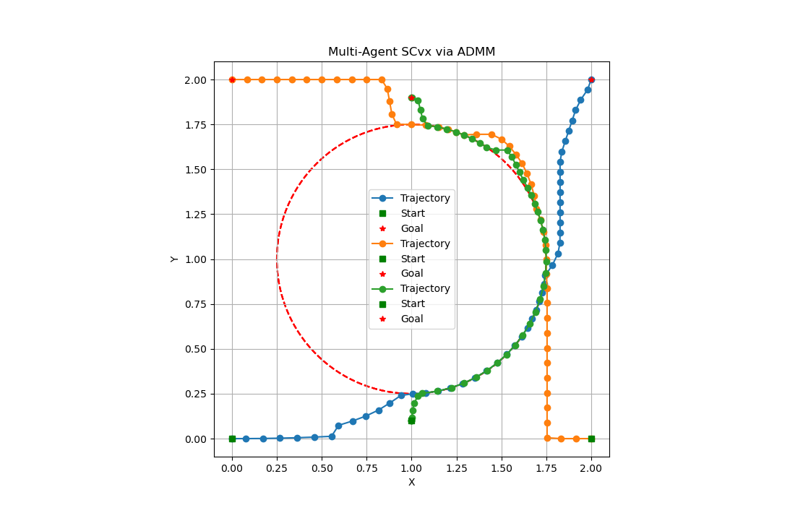
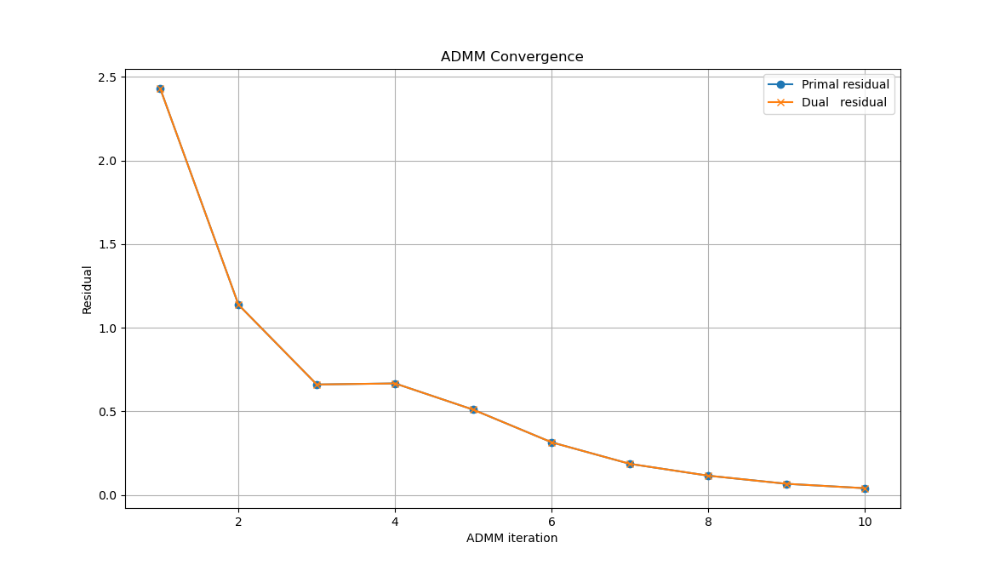
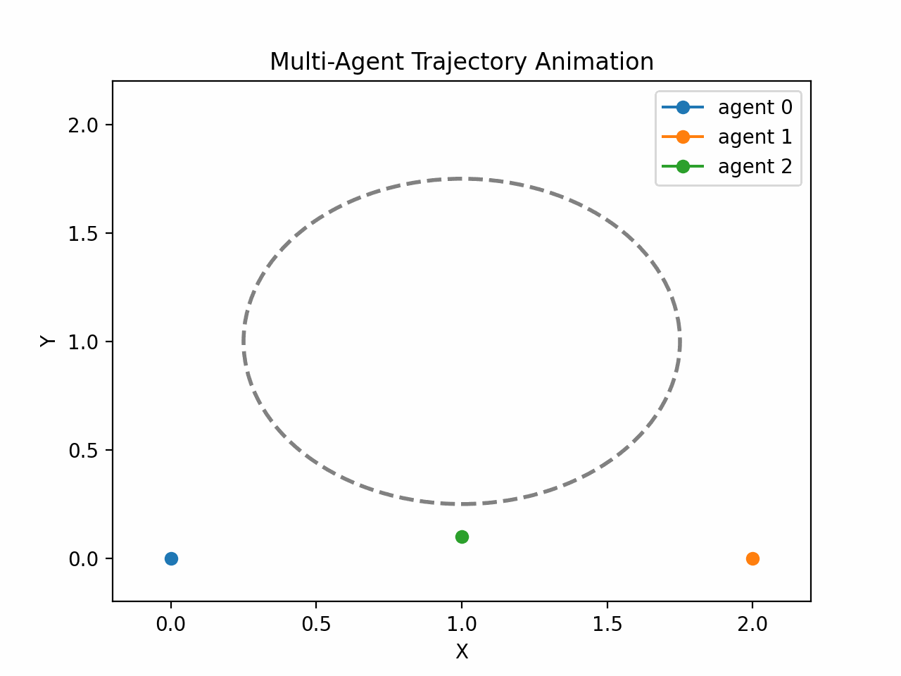

# 1. Introduction

## 1.1 Motivation for Multi-Agent Trajectory Optimization

In robotics, aerospace, and autonomous vehicle systems, multiple agents often need to navigate shared environments toward individual goals. Examples include drone swarms, satellite constellations, and delivery robots. Optimal trajectory planning for such systems must balance individual goals with safety and coordination. A centralized approach quickly becomes intractable as the number of agents increases due to the explosion in state space dimensionality. Therefore, scalable and reliable methods are needed to decompose and solve such problems efficiently.

## 1.2 Challenges: Coupling, Collision Avoidance, and Scalability

The multi-agent setting introduces unique challenges not present in single-agent trajectory optimization:
- Coupling Constraints: Agents share the environment and must coordinate their trajectories to avoid collisions.
- Collision Avoidance: Ensuring a minimum separation distance between agents across time steps is a non-convex constraint.
- Scalability: The number of pairwise constraints grows quadratically with the number of agents, which increases the computational burden significantly.

# 1.3 Benefits of Using SCvx with ADMM Decomposition

To tackle the challenges above, we use a two-level approach:
- Successive Convexification (SCvx) is applied locally to each agent to solve a non-convex trajectory optimization problem through a sequence of convex subproblems.
- Alternating Direction Method of Multipliers (ADMM) is used to coordinate these local solvers by enforcing inter-agent consensus and collision avoidance via dual variables.

This combination enables:
- Decomposition of the large-scale problem into parallelizable subproblems.
- Structured enforcement of safety constraints via consensus updates.
- Improved convergence and trajectory feasibility compared to naïve decentralized methods.

# 2. Problem Setup

## 2.1 Scenario and Agent Definitions

We consider a multi-agent trajectory optimization problem where each agent follows unicycle dynamics. Each agent $i \in {1, \dots, N}$ is defined by:
- An initial state $\mathbf{r}_i^{\text{init}} = [x_i^0, y_i^0, \theta_i^0]^\top$
- A desired terminal state $\mathbf{r}_i^{\text{final}} = [x_i^f, y_i^f, \theta_i^f]^\top$

The environment contains a set of $M$ static circular obstacles, defined by centers $\mathbf{c}_m \in \mathbb{R}^2$ and radii $r_m > 0$, for $m = 1, \dots, M$. All agents share the same obstacle map.

### 2.1.1 Initial and Final States

The initial and final states define the boundary conditions of the trajectory for each agent:
```math
\mathbf{x}_i(0) = \mathbf{r}_i^{\text{init}}, \quad \mathbf{x}_i(T) = \mathbf{r}_i^{\text{final}}
```
### 2.1.2 Shared Obstacle Map

Each obstacle is modeled as a circular region:
```math
\mathcal{O}_m = \left\{ \mathbf{p} \in \mathbb{R}^2 \,\middle|\, \| \mathbf{p} - \mathbf{c}_m \|_2 \leq r_m \right\}
```
All agents must avoid these obstacles throughout the trajectory.

## 2.2 Minimum Separation and Obstacle Clearance

### Inter-Agent Separation

To prevent collisions between agents, a minimum Euclidean distance $d_{\min}$ is enforced:

```math
\| \mathbf{p}_i(k) - \mathbf{p}_j(k) \|2 \geq d{\min}, \quad \forall\, i \ne j, \quad \forall\, k = 1, \dots, K
```
where $\mathbf{p}_i(k) = [x_i(k), y_i(k)]^\top$ is the position of agent $i$ at time step $k$.

### Obstacle Clearance

To ensure safe navigation around obstacles, we define an inflated obstacle radius:
```math
r_m^{\text{safe}} = r_m + \delta
```
where $\delta > 0$ is a clearance buffer. Additionally, agents begin and end their trajectories at a further offset $\Delta > \delta$ from any obstacle to guarantee robustness.

## 2.3 Warm-Start Initialization

A feasible initial guess for each agent’s trajectory is generated using geometric reasoning.

### 2.3.1 Obstacle-Aware Path Generation

Straight-line paths are examined between the start and goal positions. If they intersect any inflated obstacle, detour waypoints are computed using tangent lines from the start and goal positions to the obstacle boundary. These waypoints ensure the trajectory avoids entering any obstacle region.

### 2.3.2 Piecewise Linear Paths and Lifting to State Space

The planned 2D path is discretized into $K$ points, and then lifted into the full state space:
```math
\mathbf{x}_i(k) =
\begin{bmatrix}
x_i(k) \\
y_i(k) \\
\theta_i(k)
\end{bmatrix}
\quad \text{for } k = 1, \dots, K
```
The orientation $\theta_i(k)$ is estimated from the direction of motion between adjacent points. Initial control inputs $\mathbf{u}_i(k)$ are set to zero:
```math
\mathbf{u}_i(k) =
\begin{bmatrix}
v_i(k) \\
\omega_i(k)
\end{bmatrix}
= \mathbf{0}
```
These initial trajectories ${\mathbf{x}_i(k)}$ and controls ${\mathbf{u}_i(k)}$ are used to initialize the SCvx optimization for each agent.

# 3. Multi-Agent Model Design

## 3.1 Instantiating Per-Agent Dynamics
Each agent is modeled by a unicycle system with continuous-time dynamics:
```math
\dot{\mathbf{x}}_i(t) =
\begin{bmatrix}
\dot{x}_i(t) \\
\dot{y}_i(t) \\
\dot{\theta}_i(t)
\end{bmatrix}

\begin{bmatrix}
v_i(t) \cos\theta_i(t) \\
v_i(t) \sin\theta_i(t) \\
\omega_i(t)
\end{bmatrix}
\quad \text{for } i = 1, \dots, N
```

with control inputs:
```math
\mathbf{u}_i(t) =
\begin{bmatrix}
v_i(t) \\
\omega_i(t)
\end{bmatrix}
```
We discretize the system into $K$ time steps using First-Order Hold (FOH), yielding:
```math
\mathbf{x}_i(k+1) = f_d(\mathbf{x}_i(k), \mathbf{u}_i(k), \mathbf{u}_i(k+1), \Delta t)
```

Each agent $i$ has its own dynamics function $f_i$ and corresponding Jacobians $A_i(k)$ and $B_i(k)$ used in linearizations within SCvx:
```math
\delta \mathbf{x}_i(k+1) \approx A_i(k) \delta \mathbf{x}_i(k) + B_i(k) \delta \mathbf{u}_i(k)
```

## 3.2 Centralized vs. Decentralized Structure

We compare two formulations:

### Centralized

A single optimization problem encodes all agents, their dynamics, control inputs, and coupling constraints:
```math
\min_{\{\mathbf{x}_i, \mathbf{u}_i\}_{i=1}^N} \sum_{i=1}^N J_i(\mathbf{x}_i, \mathbf{u}_i)
\quad \text{s.t.} \quad
\begin{cases}
\text{dynamics of all agents} \\
\text{static and dynamic constraints} \\
\text{inter-agent collision avoidance}
\end{cases}
```

This is computationally intensive and scales poorly with $N$.

### Decentralized (SCvx + ADMM)

Each agent solves a local convex subproblem using SCvx. Coupling is handled via ADMM consensus variables for position estimates and dual variables enforcing inter-agent consistency.

Each agent optimizes its trajectory subject to:

- Dynamics linearized around previous iteration
- Local constraints (e.g., bounds, obstacle avoidance)
- Coupling terms enforced via consensus and dual update rules

This enables parallelized and scalable optimization.

## 3.3 Inter-Agent Collision Constraints (Linearization)

At each time step $k$, we require that the position of agent $i$ and $j$ satisfies:
```math
\|\mathbf{p}_i(k) - \mathbf{p}_j(k)\|_2 \geq d{\min}
\quad \text{for all } i \ne j
```
To preserve convexity, we linearize this constraint at reference trajectories $\mathbf{p}_i^{\text{ref}}(k)$ and $\mathbf{p}_j^{\text{ref}}(k)$. Let:
```math
\mathbf{a}{ij}(k) = \frac{\mathbf{p}_i^{\text{ref}}(k) - \mathbf{p}_j^{\text{ref}}(k)}{\|\mathbf{p}_i^{\text{ref}}(k) - \mathbf{p}_j^{\text{ref}}(k)\|_2 + \epsilon}
```

Then the linearized constraint becomes:
```math
\mathbf{a}{ij}(k)^\top \left(\mathbf{p}_i(k) - \mathbf{p}_j^{\text{ref}}(k)\right) \geq d{\min}
```

This enforces a separating hyperplane between agent $i$’s trajectory and agent $j$’s reference trajectory.

To handle infeasibility due to linearization, we introduce slack variables $s_{ij}(k) \geq 0$, and penalize them in the objective:
```math
\mathbf{a}_{ij}(k)^\top \left(\mathbf{p}_i(k) - \mathbf{p}_j^{\text{ref}}(k)\right) + s_{ij}(k) \geq d_{\min}
```

The term $\sum s_{ij}(k)$ is weighted in the objective to discourage inter-agent violations.

# 4. ADMM Coordination Algorithm

## 4.1 Overview of ADMM in Trajectory Optimization

The Alternating Direction Method of Multipliers (ADMM) is used to decompose a coupled optimization problem into agent-level subproblems. In the multi-agent SCvx setting, the centralized optimization:

```math
\min_{\{\mathbf{x}_i, \mathbf{u}_i\}_{i=1}^N} \sum_{i=1}^N J_i(\mathbf{x}_i, \mathbf{u}_i)
\quad \text{s.t.} \quad \text{agent dynamics, bounds, and inter-agent constraints}
```

is reformulated by introducing local copies of shared variables and enforcing consensus between agents.

ADMM proceeds by iterating over three updates:
1.	Local minimization (per agent)
2.	Consensus variable update
3.	Dual variable (Lagrange multiplier) update

This enables solving the multi-agent problem in parallel, while maintaining coordination via augmented Lagrangian terms.

## 4.2 Consensus Variables and Dual Updates

Let $\mathbf{p}_i(k) \in \mathbb{R}^2$ be the position of agent $i$ at time $k$. Each agent maintains estimates $\mathbf{Y}_{ij}(k)$ of its neighbors’ positions $\mathbf{p}_j(k)$.

### Consensus enforcement:

For every agent pair $(i, j)$ and each timestep $k$, ADMM enforces:
```math
\mathbf{p}_j(k) = \mathbf{Y}_{ij}(k)
```

### Augmented Lagrangian term:

The consensus constraint is relaxed using Lagrange multipliers $\boldsymbol{\lambda}_{ij}(k)$ and a quadratic penalty with parameter $\rho > 0$:
```math
\mathcal{L}_{ij} = \sum_{k=1}^{K} \boldsymbol{\lambda}_{ij}(k)^\top (\mathbf{p}_j(k) - \mathbf{Y}_{ij}(k)) + \frac{\rho}{2} \|\mathbf{p}_j(k) - \mathbf{Y}_{ij}(k)\|_2^2
```

### ADMM dual updates:

After solving the agent subproblems, we update:
#### 1. Consensus estimate:
```math
\mathbf{Y}{ij}^{(t+1)}(k) = \frac{1}{2} \left( \mathbf{Y}{ij}^{(t)}(k) + \mathbf{p}_j^{(t+1)}(k) \right)
```
#### 2.Dual variable:
```math
\boldsymbol{\lambda}{ij}^{(t+1)}(k) = \boldsymbol{\lambda}{ij}^{(t)}(k) + \rho \left( \mathbf{p}j^{(t+1)}(k) - \mathbf{Y}{ij}^{(t+1)}(k) \right)
```

## 4.3 Agent-Level Convex Subproblem Setup

Each agent solves a convex optimization problem derived from linearizing its dynamics and constraints:

### Local cost function:
```math
J_i = J_{\text{SCvx},i}(\mathbf{x}_i, \mathbf{u}_i) + \sum_{j \ne i} \left[
\sum_{k=1}^{K} \left( \boldsymbol{\lambda}_{ij}^\top (\mathbf{p}_i(k) - \mathbf{Y}_{ij}(k)) + \frac{\rho}{2} \|\mathbf{p}_i(k) - \mathbf{Y}_{ij}(k)\|_2^2 \right)
w_s \sum_{k=1}^{K} s_{ij}(k)
\right]
```

Here:
- $J_{\text{SCvx},i}$ is the standard convexified SCvx objective for agent $i$
- $s_{ij}(k)$ are slack variables for linearized inter-agent separation
- $w_s$ is the penalty weight for slack variables

### Local constraints include:
- Linearized dynamics: $\mathbf{x}_i(k+1) \approx A_i(k) \mathbf{x}_i(k) + B_i(k) \mathbf{u}_i(k)$
- Static obstacle avoidance
- Linearized inter-agent separation:
```math
\mathbf{a}_{ij}(k)^\top (\mathbf{p}_i(k) - \mathbf{Y}_{ij}(k)) + s_{ij}(k) \geq d_{\min}
```

## 4.4 Residuals and Convergence Tracking

To assess convergence of the ADMM procedure, we compute primal and dual residuals at each iteration.

### Primal residual:

Measures how well consensus is enforced:
```math
r^{\text{prim}}_{ij} = \|\mathbf{p}_j - \mathbf{Y}_{ij}\|_F
```

### Dual residual:

Measures how much the consensus variable changed:
```math
r^{\text{dual}}_{ij} = \|\mathbf{Y}_{ij}^{(t+1)} - \mathbf{Y}_{ij}^{(t)}\|_F
```
### Convergence criterion:

We declare convergence when:
```math
r^{\text{prim}} < \epsilon_{\text{prim}}, \quad
r^{\text{dual}} < \epsilon_{\text{dual}}
```

for all $(i, j)$, with predefined tolerances.

# 5. SCvx for Individual Agents

Each agent in the multi-agent setting solves its own Successive Convexification (SCvx) subproblem to update its trajectory. SCvx transforms a non-convex optimal control problem into a sequence of convex subproblems through local linearization and trust region constraints.

⸻

## 5.1 Use of First-Order Hold (FOH) Discretization

We discretize the continuous-time dynamics using First-Order Hold (FOH) on the control inputs:

Let the continuous-time dynamics be:
```math
\dot{\mathbf{x}}(t) = f(\mathbf{x}(t), \mathbf{u}(t))
```

Over the time interval $[t_k, t_{k+1}]$, with control inputs $\mathbf{u}_k, \mathbf{u}_{k+1}$ and duration $h_k$, define:
```math
\mathbf{u}(t) = \alpha_k(t) \mathbf{u}_k + \beta_k(t) \mathbf{u}_{k+1}
```

where $\alpha_k(t) = 1 - \frac{t - t_k}{h_k}$ and $\beta_k(t) = \frac{t - t_k}{h_k}$.

Linearizing $f$ around a reference trajectory $(\bar{\mathbf{x}}_k, \bar{\mathbf{u}}k)$ gives discretized matrices:
```math
\mathbf{x}{k+1} \approx A_k \mathbf{x}_k + B_k \mathbf{u}k + C_k \mathbf{u}{k+1} + S_k \nu_k + \mathbf{z}_k
```
where $\nu_k$ is the defect variable used to enforce exact dynamics.

## 5.2 Trust Region and Defect Penalization

To ensure convergence and handle model approximation errors, SCvx uses:

### (a) Trust region on state updates:

```math
\|\mathbf{x}_k - \bar{\mathbf{x}}_k\|_2 \leq \Delta, \quad \forall k
```

This restricts the deviation from the reference trajectory, with $\Delta$ adjusted adaptively across iterations.

### (b) Defect penalization:

We introduce defect variables $\nu_k$ and penalize their norms in the objective:
```math
J_{\text{defect}} = w_\nu \sum_{k=1}^{K-1} \|\nu_k\|_2^2
```

The defect $\nu_k$ measures the residual from discretized dynamics:
```math
\nu_k = \mathbf{x}_{k+1} - \left( A_k \mathbf{x}_k + B_k \mathbf{u}_k + C_k \mathbf{u}_{k+1} + \mathbf{z}_k \right)
```

### (c) Optional time scaling:

If the final time $T$ is a decision variable, we define a scalar $\sigma$ such that $T = \sigma T_0$, and include:
```math
J_{\text{time}} = w_\sigma \sigma
```

## 5.3 Integration with ADMM-Augmented Terms

Each agent’s SCvx subproblem includes both standard SCvx terms and ADMM-based coordination terms from Section 4.

### Full agent-level cost:

```math
J_i = J_{\text{SCvx}, i} + \sum_{j \neq i} \sum_{k=1}^K \left[
\boldsymbol{\lambda}_{ij}(k)^\top (\mathbf{p}_i(k) - \mathbf{Y}_{ij}(k)) + \frac{\rho}{2} \|\mathbf{p}_i(k) - \mathbf{Y}_{ij}(k)\|2^2 + w_s s_{ij}(k)
\right]
```

Here:
- $J_{\text{SCvx}, i}$ includes control effort, curvature penalties, defect penalties, and trust region slack
- $\mathbf{p}_i(k)$ is agent $i$’s 2D position at time $k$
- $\mathbf{Y}_{ij}(k)$ is the consensus position copy of agent $j$ used by agent $i$
- $s_{ij}(k)$ is a slack variable to handle softened collision constraints

### Collision constraint (linearized, hard or soft):

```math
\hat{\mathbf{n}}_{ij}(k)^\top (\mathbf{p}_i(k) - \mathbf{Y}_{ij}(k)) + s_{ij}(k) \geq d_{\min}
```

where $\hat{\mathbf{n}}_{ij}(k)$ is the linearization direction and $d_{\min}$ is the minimum separation threshold.

# 6. Implementation Details

This section bridges the mathematical formulation from earlier sections with its corresponding implementation in the codebase. Each component is carefully mapped to its theoretical role in solving the multi-agent trajectory optimization problem using SCvx and ADMM.

## 6.1 Code Architecture

The system is implemented in a modular Python package structured as follows:

### 6.1.1 $\texttt{MultiAgentModel}$
**Purpose**: Holds per-agent dynamics models and shared obstacle information.

**Math Link**: Instantiates $N$ copies of $\texttt{GameUnicycleModel}$, each with:
- Initial and final states $\mathbf{x}_0^i$, $\mathbf{x}_f^i$
- Collision radius $r_c$ (for hard constraints)
- Dynamics $f^i(\mathbf{x}^i, \mathbf{u}^i)$

**Location**: *SCvx.models.multi_agent_model.MultiAgentModel*

### 6.1.2 $\texttt{AgentBestResponse}$
**Purpose**: Solves the best-response convex subproblem for a single agent.

**Math Link**: Implements the agent-level SCvx optimization (Section 5), incorporating:
- FOH-based discretization matrices $(A_k, B_k, C_k, S_k, z_k)$
- Trust region constraints and defect penalties
- Linearized inter-agent collision constraints
- Optional ADMM-augmented Lagrangian terms

**Location**: *SCvx.optimization.agent_best_response.AgentBestResponse*

### 6.1.3 $\texttt{NashSolver}$ or $\texttt{ADMMCoordinator}$
**Purpose**: Coordinates multi-agent optimization via either:
- Iterative Best Response (IBR) in NashSolver
- ADMM updates in ADMMCoordinator (if implemented)
**Math Link**: Handles:
- Outer iterations between agents
- Passing neighbors’ trajectories as fixed parameters
- Updating consensus variables $\mathbf{Y}_{ij}$ and duals $\boldsymbol{\lambda}_{ij}$ if using ADMM

**Location**:
- IBR: *SCvx.optimization.nash_solver.NashSolver*
- ADMM: *SCvx.optimization.admm_coordinator.ADMMCoordinator*

## 6.2 Parameter Settings

The optimization is controlled by several key global parameters (in SCvx/global_parameters.py), which reflect the mathematical weights and tolerances introduced earlier.

### 6.2.1 ADMM Penalty and Weights


| Symbol           | Code Variable       | Description                                          |
|------------------|---------------------|------------------------------------------------------|
| rho              | rho_admm            | ADMM penalty parameter in augmented Lagrangian      |
| w_nu             | WEIGHT_NU           | Weight on dynamics defect penalty                   |
| w_sigma          | WEIGHT_SIGMA        | Weight on final time scaling                        |
| w_slack          | WEIGHT_SLACK        | Penalty weight for collision slack variables        |

**Location**: *SCvx/global_parameters.py*

### 6.2.2 Slack Variables and Rho Updates
- Slack variables $s_{ij}(k)$ are created only if soft constraints are allowed. These are declared in the cost function to allow slight constraint violations when inter-agent distances approach $d_{\min}$.
- Dual variables $\boldsymbol{\lambda}_{ij}(k)$ are updated according to:
```math
\boldsymbol{\lambda}_{ij}^{(t+1)} = \boldsymbol{\lambda}_{ij}^{(t)} + \rho \left( \mathbf{p}_i^{(t+1)} - \mathbf{Y}_{ij}^{(t+1)} \right)
```

- The code can include adaptive $\rho$ tuning based on the primal and dual residuals:
```math
r_{\text{prim}} = \|\mathbf{p}_i - \mathbf{Y}_{ij}\|2, \quad r_{\text{dual}} = \|\rho (\mathbf{Y}_{ij}^{(t)} - \mathbf{Y}_{ij}^{(t-1)})\|_2
```

Implemented (or to be added) in: $\texttt{ADMMCoordinator.update\_duals()}$ and $\texttt{update\_rho()}$.

## 7. Experimental Results

### 7.1 Scenario Description and Setup

The experiment simulates a non-cooperative trajectory optimization problem involving 3 agents navigating around a shared static obstacle using SCvx and ADMM.

| Parameter            | Code Variable      | Value / Description                                                  |
|----------------------|--------------------|----------------------------------------------------------------------|
| Discretization Steps | `K`                | 50 time steps                                                        |
| Obstacle Location    | `OBSTACLES`        | Disk centered at (1.0, 1.0) with radius 0.25                         |
| Collision Margin     | `CLEARANCE`        | 0.05 m inflation band for initial path planning                      |
| Min Separation       | `D_MIN` / `COLL_RAD` | Desired pairwise buffer = 0.5 m (used both in cost and visualization)|
| Extra Goal Offset    | `MARGIN`           | 0.6 m buffer used for vertical agent path                            |

#### Agent Definitions

| Agent | Start Position         | Goal Position          | Notes                                                             |
|-------|------------------------|------------------------|-------------------------------------------------------------------|
| 0     | (0.0, 0.0, 0.0)        | (2.0, 2.0, 0.0)        | Moves diagonally from lower-left to upper-right                   |
| 1     | (2.0, 0.0, 0.0)        | (0.0, 2.0, 0.0)        | Moves diagonally from lower-right to upper-left                   |
| 2     | (1.0, ~0.1, 0.0)       | (1.0, ~1.9, 0.0)       | Passes vertically beneath and above the central obstacle          |

#### Cost Weights (all agents)

| Cost Term           | Variable              | Value |
|---------------------|------------------------|--------|
| Control Effort      | `control_weight`       | 100.0 |
| Collision Slack     | `collision_weight`     | 10.0  |
| Control Rate        | `control_rate_weight`  | 5.0   |
| Curvature Smoothing | `curvature_weight`     | 5.0   |

---

### 7.2 Final Trajectories

<p align="center">
  
  <br/>
  <em>Figure 7.1: Final optimized trajectories for 3 agents. All avoid the central obstacle while respecting minimum separation.</em>
</p>

---

### 7.3 ADMM Convergence Plots

<p align="center">
  
  <br/>
  <em>Figure 7.2: Convergence plot showing residuals and cost decrease over ADMM iterations.</em>
</p>

---

### 7.4 Animation of Agent Motions

<p align="center">
  
  <br/>
  <em>Figure 7.3: Animated evolution of agent positions as they follow their optimal trajectories.</em>
</p>

