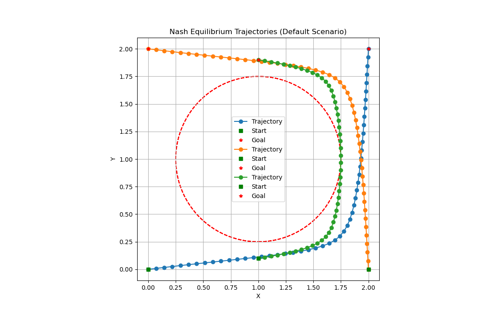
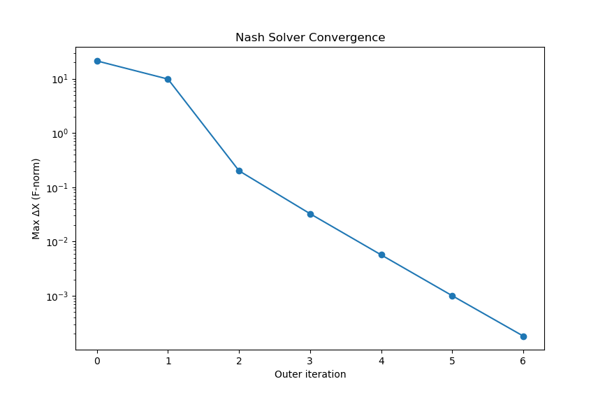
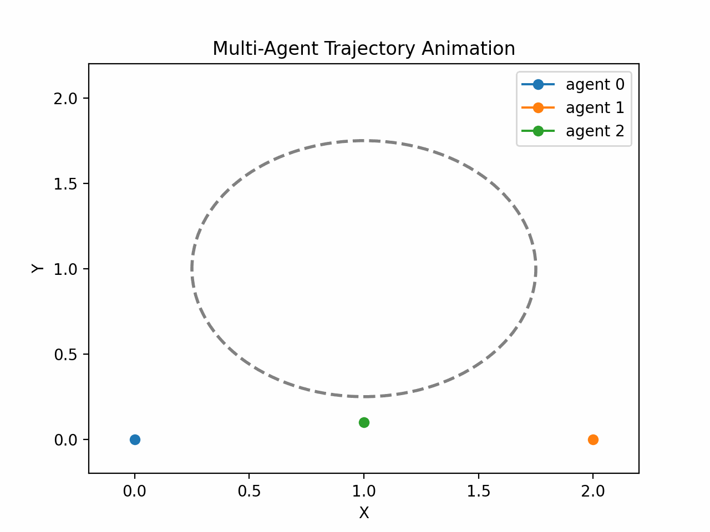
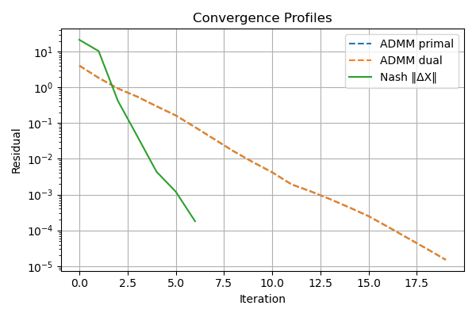
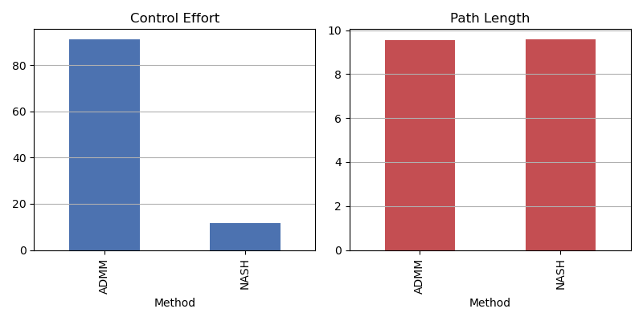
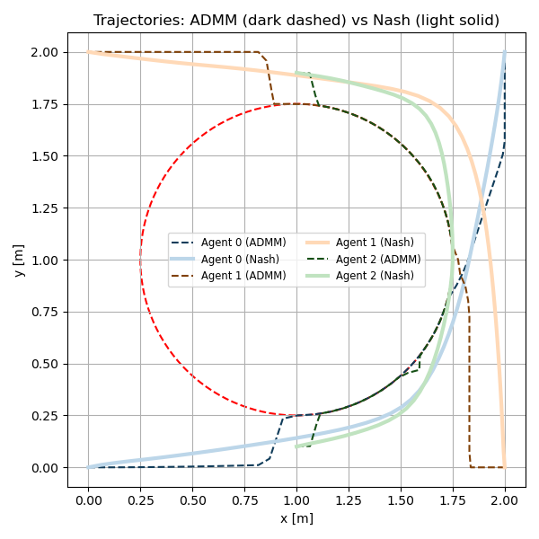
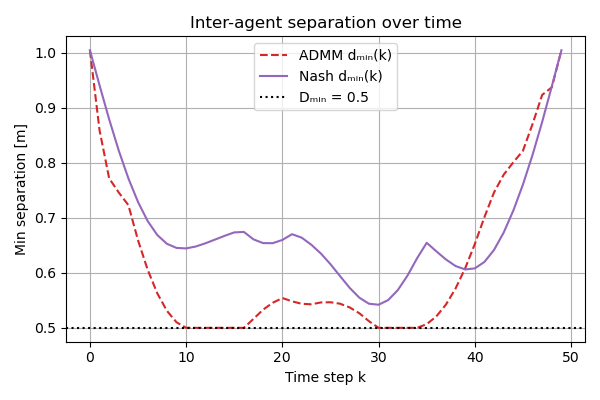

# 1. Introduction

## 1.1 Problem Motivation

In multi-agent systems such as autonomous drone swarms, mobile robots, or satellite constellations, each agent must plan a trajectory to reach its goal without collisions and while respecting its own dynamics. Centralized methods often scale poorly with the number of agents due to:
- The curse of dimensionality in the joint state space.
- The communication bottleneck between agents and a central planner.
- Lack of privacy or autonomy for independently governed agents.

A more scalable and decentralized alternative is to treat the problem as a non-cooperative game, where each agent solves its own trajectory optimization by considering the others’ strategies as fixed.

⸻

## 1.2 Nash Games in Multi-Agent Motion Planning

We model the interaction as a Nash game over the space of control trajectories:
- Let agent $i \in \{1, \dots, N\}$ have control input $u_i(t)$ and state $x_i(t)$.
- Each agent minimizes its own cost functional:
```math
J_i(x_i, u_i; \{x_j\}_{j \neq i}) = \int_0^T \ell_i(x_i(t), u_i(t)) \, dt + \Phi_i(x_i(T))
```

subject to dynamics:
$\dot{x}_i = f_i(x_i, u_i), \quad x_i(0) = x_i^0$
and collision constraints:
```math
\|x_i(t) - x_j(t)\| \geq d_{\min}, \quad \forall j \neq i, \; \forall t \in [0, T]
```

In this formulation, agents simultaneously minimize their cost while reacting to the others’ planned trajectories, which leads to a Nash equilibrium:
```math
\forall i,\quad (x_i^*, u_i^*) = \arg\min_{x_i, u_i} J_i(x_i, u_i; \{x_j^*\}_{j \neq i})
```
⸻

## 1.3 Challenges with Decentralization and Coupling

While Nash games offer decentralization, they introduce several mathematical and algorithmic challenges:
- Coupling through constraints: Collision avoidance inherently couples agents’ decision spaces.
- Non-convexity: The dynamics and constraints make the optimization landscape non-convex.
- Convergence to equilibria: Iterative best-response updates do not always converge and can oscillate or diverge.

To address these, we embed each agent’s optimization within a Sequential Convex Programming (SCvx) framework and coordinate agents through Iterative Best Response (IBR) updates. Our method leverages convexification of nonlinear constraints and trust regions to ensure stability and convergence.

# 2. Mathematical Formulation

## 2.1 Agent Dynamics (Unicycle Model)

Each agent $i \in \{1, \dots, N\}$ is modeled using the unicycle dynamics:

```math
\dot{x}_i = v_i \cos(\theta_i), \quad
\dot{y}_i = v_i \sin(\theta_i), \quad
\dot{\theta}_i = \omega_i
```

or in vector form:

```math
\dot{r}_i = f(r_i, u_i), \quad
\text{where } r_i = \begin{bmatrix} x_i \\ y_i \\ \theta_i \end{bmatrix}, \quad
u_i = \begin{bmatrix} v_i \\ \omega_i \end{bmatrix}
```

This is discretized using First-Order Hold (FOH) over K time steps for use in trajectory optimization.

## 2.2 Cost Terms per Agent

Each agent i minimizes a convexified objective composed of weighted cost terms:

```math
J_i = J_{\text{ctrl}} + J_{\text{rate}} + J_{\text{curv}} + J_{\text{inertia}}
```

### 2.2.1 Control Effort

```math
J_{\text{ctrl}} = w_{\text{ctrl}} \sum_{k=0}^{K-1} \| u_i(k) \|^2
```

This penalizes aggressive control inputs (both linear and angular velocity).

### 2.2.2 Control Rate Smoothing

```math
J_{\text{rate}} = w_{\text{rate}} \sum_{k=0}^{K-2} \| u_i(k+1) - u_i(k) \|^2
```

Promotes smooth changes in control inputs across the trajectory.

### 2.2.3 Heading Curvature

```math
J_{\text{curv}} = w_{\text{curv}} \sum_{k=0}^{K-2} \left( \theta_i(k+1) - \theta_i(k) \right)^2
```

Reduces rapid heading changes and encourages natural turning behavior.

### 2.2.4 Inertia Regularization

```math
J_{\text{inertia}} = w_{\text{inertia}} \sum_{k=0}^{K-1} \| r_i(k) - r_i^{\text{prev}}(k) \|^2
```

Regularizes trajectory updates by discouraging large deviations from previous iterations.

## 2.3 Hard Collision Constraints

To ensure safe distances between agents i and j, we linearize the collision constraint around previous trajectories:

```math
\hat{n}_{ij}^{(k)} = \frac{r_i^{\text{prev}}(k) - r_j^{\text{prev}}(k)}{\|r_i^{\text{prev}}(k) - r_j^{\text{prev}}(k)\|}
```

```math
\hat{n}_{ij}^{(k)}{}^\top \left( r_i(k) - r_j(k) \right) \geq d_{\text{min}}, \quad \forall k = 0, \dots, K-1
```

This constraint is added as a hard constraint to each agent’s optimization problem, ensuring minimum separation $d_{\text{min}}$.

## 2.4 Nash Equilibrium Definition (Best-Response Fixed Point)

We define the Nash equilibrium as a fixed point of iterative best responses:

```math
\left\{ (r_i^*, u_i^*) \right\}_{i=1}^N \quad \text{such that} \quad
(r_i^*, u_i^*) = \arg \min_{r_i, u_i} J_i(r_i, u_i; \{r_j^*\}_{j \ne i})
```

Each agent optimizes its own cost, treating other agents’ trajectories as fixed. Iterating this best-response process leads to convergence under suitable conditions (e.g., convex cost, smooth constraints, trust regions).

# 3. Game-Specific Model Extensions

This section describes how agent-specific modeling and interaction terms are incorporated into the mathematical formulation of a non-cooperative multi-agent trajectory game.

⸻

## 3.1 Per-Agent Cost Structure

Each agent $i \in \{1, \dots, N\}$ is modeled with its own dynamics and a personalized cost function, leading to a non-cooperative game formulation. The decision variables for agent $i$ are its state $X_i \in \mathbb{R}^{n \times K}$ and control$ U_i \in \mathbb{R}^{m \times K}$, over a time horizon of $K$ steps.

The cost function for agent $i$ is defined as:
```math
J_i(X_i, U_i; X_{-i}) = J_{\text{ctrl},i} + J_{\text{rate},i} + J_{\text{curv},i} + J_{\text{inertia},i}
```

where each term is:
- Control Effort:
```math
J_{\text{ctrl},i} = w_{\text{ctrl}}^i \sum_{k=0}^{K-1} \| u_i(k) \|^2
```

- Control Rate Smoothing:
```math
J_{\text{rate},i} = w_{\text{rate}}^i \sum_{k=0}^{K-2} \| u_i(k+1) - u_i(k) \|^2
```

- Heading Curvature (for orientation $\theta_i$):
```math
J_{\text{curv},i} = w_{\text{curv}}^i \sum_{k=0}^{K-2} \left( \theta_i(k+1) - \theta_i(k) \right)^2
```

- Inertia Regularization (distance to previous trajectory):
```math
J_{\text{inertia},i} = w_{\text{inertia}}^i \sum_{k=0}^{K-1} \| X_i(k) - X_i^{\text{prev}}(k) \|^2
```

Here, $w_{\text{ctrl}}^i, w_{\text{rate}}^i, \ldots$ are agent-specific weights, and $X_i^{\text{prev}}$ is the previous iterate of the agent’s trajectory.

## 3.2 Game-Theoretic Coupling via Constraints

Agents are coupled through collision avoidance constraints, which are applied as hard constraints in the optimization problem.

For every pair of distinct agents $i \ne j$, a minimum separation constraint is enforced. Let $p_i(k) \in \mathbb{R}^2$ denote the position of agent $i$ at timestep $k$. The linearized constraint for each timestep $k$ is:
1. Relative position (frozen at previous iterates):
$d_{ij}^{(k)} = p_i^{\text{prev}}(k) - p_j^{\text{prev}}(k)$
2. Unit normal vector:
```math
\hat{n}_{ij}^{(k)} = \frac{d_{ij}^{(k)}}{\| d_{ij}^{(k)} \|}
```
3. Linearized constraint:
```math
\hat{n}_{ij}^{(k)\top} \left( p_i(k) - p_j(k) \right) \ge d_{\text{min}}^i
```

This enforces a convexified buffer zone around each agent at every timestep, maintaining distance without introducing non-convex constraints.

## 3.3 Agent-Level Optimization Problem

Each agent solves the following constrained optimization problem:

```math
\begin{aligned}
\min_{X_i, U_i} \quad & J_i(X_i, U_i; X_{-i}) \\
\text{s.t.} \quad
& X_i(k+1) = f_d(X_i(k), U_i(k)), \quad k = 0, \dots, K-1 \\
& X_i(0) = x_{i,\text{init}}, \quad X_i(K) = x_{i,\text{final}} \\
& \hat{n}_{ij}^{(k)\top} \left( p_i(k) - p_j(k) \right) \ge d_{\text{min}}^i, \quad \forall j \ne i, \, \forall k
\end{aligned}
```

where $f_d$ denotes the discretized unicycle dynamics. The linearized constraints depend on the neighbors’ previous trajectories, yielding a best-response structure.

# 4. Nash Optimization Algorithm

This section formalizes the algorithmic structure used to compute a Nash equilibrium in a multi-agent trajectory optimization problem using iterative best-response dynamics.

## 4.1 Iterative Best Response (IBR)

In a non-cooperative game, each agent seeks to minimize its own objective function assuming the strategies (trajectories) of other agents are fixed.

Let $\mathcal{X} = (X_1, \dots, X_N)$ denote the joint state trajectories and $\mathcal{U} = (U_1, \dots, U_N)$ the joint control trajectories of all agents. A Nash equilibrium satisfies:

```math
(X_i^*, U_i^*) = \arg\min_{X_i, U_i} \; J_i(X_i, U_i; X_{-i}^*, U_{-i}^*) \quad \forall i \in \{1, \dots, N\}
```

The Iterative Best Response (IBR) algorithm approximates the Nash equilibrium via a fixed-point iteration. At iteration $t$, each agent solves:

```math
(X_i^{(t)}, U_i^{(t)}) = \arg\min_{X_i, U_i} \; J_i(X_i, U_i; X_{-i}^{(t-1)})
```

The algorithm proceeds by updating each agent sequentially or in parallel, using the most recent trajectory information of the others.

## 4.2 AgentBestResponse: Local Convex Subproblem

Each best-response problem is formulated using Successive Convexification (SCvx), where the agent solves a convex approximation of its nonlinear trajectory optimization problem.

For agent $i$, given:
- previous iterate $X_i^{\text{prev}}, U_i^{\text{prev}}$,
- linearization of its dynamics $f_d$,
- neighbor trajectories $\{X_j^{\text{prev}} \}_{j \ne i}$,

the local convex program becomes:

```math
\begin{aligned}
\min_{X_i, U_i} \quad & J_i^{\text{convex}}(X_i, U_i; X_{-i}^{\text{prev}}) \\
\text{s.t.} \quad
& \text{Discretized linear dynamics: } A_i X_i + B_i U_i = z_i \\
& \text{Linearized collision constraints: } \hat{n}_{ij}^\top(p_i - p_j^{\text{prev}}) \ge d{\min} \\
& \text{Trust region constraints: } \| X_i - X_i^{\text{prev}} \|_F \le \delta_i
\end{aligned}
```

Here, $A_i, B_i$ are discretized dynamics matrices, and $\delta_i$ is a trust-region radius.


## 4.3 NashSolver: Outer Loop Coordination

The outer loop coordinates all agents by sweeping through them one-by-one, letting each solve its best-response problem while holding the others fixed. The full algorithm is as follows:

⸻

Iterative Best-Response Algorithm:
1. Initialize $X_i^{(0)}, U_i^{(0)}$ for all $i$
2. For iteration $t = 1, 2, \dots$:
    - For each agent $i = 1, \dots, N$:
        ```math
        (X_i^{(t)}, U_i^{(t)}) \leftarrow \arg\min_{X_i, U_i} J_i(X_i, U_i; X_{-i}^{(t-1)})
        ```
    - Compute total state change:
        ```math
        \Delta^{(t)} = \max_i \| X_i^{(t)} - X_i^{(t-1)} \|_F
        ```
    - If $\Delta^{(t)} < \texttt{tol}$, terminate

## 4.4 Convergence Criterion (‖ΔX‖ < tol)

The algorithm halts when the maximum state change between iterations is sufficiently small:

$$\Delta^{(t)} := \max_i \| X_i^{(t)} - X_i^{(t-1)} \|_F < \varepsilon$$

This reflects convergence to a fixed point in trajectory space, i.e., a Nash equilibrium where no agent has incentive to deviate given others’ strategies.

# 5. Code Architecture

This section explains how the theoretical components of the Nash-game-based multi-agent trajectory optimization are implemented in code. The system is designed with modularity and clarity in mind, allowing each agent to solve its own optimal control problem while interacting with others through shared state trajectories.

⸻

## 5.1 Overview

The implementation is structured around three core classes, each corresponding to a key theoretical element:
- $\texttt{GameUnicycleModel}$: encapsulates agent-specific dynamics and cost structure.
- $\texttt{AgentBestResponse}$: builds and solves the convex best-response problem for a single agent.
- $\texttt{NashSolver}$: orchestrates the iterative optimization loop across all agents.

⸻

### 5.1.1 $\texttt{GameUnicycleModel}$
- Extends a base unicycle model by adding agent-specific cost weights (e.g., control effort, curvature, collision avoidance).
- Implements *get_cost_function()*, which generates a CVXPY expression equivalent to the convexified cost:
```math
J_i^{\text{convex}} = w_u \| U_i \|^2 + w_{\dot{u}} \| \Delta U_i \|^2 + w_{\theta} \| \Delta \theta_i \|^2 + \text{(collision constraints)} + \text{(inertia)}
```
- Also generates linearized collision constraints with respect to neighbors using directional derivatives.

⸻

### 5.1.2 AgentBestResponse
- Represents an individual agent’s best-response solver.
- At each outer iteration:
    - Accepts neighbor trajectories$ $\{X_j^{\text{prev}}\}_{j \ne i}$ as parameters.
    - Injects dynamics linearization matrices $(A_i, B_i, \dots)$, reference trajectories $(X_i^{\text{ref}}, U_i^{\text{ref}})$, and trust region radius.
    - Constructs a convex optimization problem using CVXPY, matching the form in Section 4.2:
    ```math
    \min \; \text{SCvx}(X_i, U_i) + J_i^{\text{convex}}(X_i, U_i; X_{-i})
    ```
- On solve, returns updated trajectories $X_i, U_i$ and slack variables.

⸻

### 5.1.3 NashSolver
- Implements the Iterative Best Response (IBR) loop from Section 4.
- Holds a list of AgentBestResponse solvers, one per agent.
- For each outer iteration:
    - Linearizes dynamics for each agent based on its current trajectory.
    - Calls AgentBestResponse.setup() to build each convex subproblem.
    - Solves each agent’s problem sequentially.
    - Monitors change in trajectories $\|X_i^{(t)} - X_i^{(t-1)}\|$ and halts when convergence is achieved.

⸻

## 5.2 Parameter Injection and Problem Setup

All CVXPY variables and parameters are created once and reused across iterations for efficiency. The typical data flow per agent is:
1.	Trajectory Guess: From warm start (e.g., straight-line initialization).

2.	Dynamics Linearization: Via FirstOrderHold.

3.	Parameter Injection:
    - $X_i^{\text{prev}}$ for trust region and inertia.
    - $X_j^{\text{prev}}$ for linearized inter-agent constraints.
4.	Problem Construction: Cost and constraints are composed in get_cost_function() and added to the SCvx base problem.
5.	Solve: A single agent’s updated result is returned and inserted into the global trajectory list.

⸻

## 5.3 Reusability: Wrapping Around SCvx

The entire Nash game formulation wraps around an existing SCvx optimizer, reused as the backbone for each agent’s problem. This promotes:
- Code reuse: all trajectory, trust-region, and slack-handling mechanisms are inherited from SCvx.
- Consistency: ensures each agent’s local optimization aligns with a unified mathematical structure.
- Extensibility: allows future extension to include soft collisions, time-varying dynamics, or cooperative variants.

## 7. Experimental Results

This section presents the setup and outcomes of a Nash-game-based trajectory optimization involving three non-cooperative agents in a shared workspace with static obstacles. Each agent solves a convexified local problem using SCvx, coordinated through an iterative best-response loop.

---

### 7.1 Agent Definitions (Init/Goal, Weights)

The table below summarizes the agent settings:

| Agent | Initial State (x, y, θ) | Final State (x, y, θ) | Control Weight \($w_u$\) | Collision Weight \($w_{\text{coll}}$\) | Radius \($r_{\text{coll}}$\) | Control Rate \($w_{\dot{u}}$\) | Curvature \($w_{\kappa}$\) |
|-------|--------------------------|------------------------|------------------------|------------------------------|------------------------|-----------------------------|----------------------|
| 0     | (0.0, 0.0, 0.0)          | (2.0, 2.0, 0.0)        | 100.0                 | 10.0                         | 0.5                    | 5.0                         | 5.0                  |
| 1     | (2.0, 0.0, 0.0)          | (0.0, 2.0, 0.0)        | 100.0                 | 10.0                         | 0.5                    | 5.0                         | 5.0                  |
| 2     | (1.0, 0.1, 0.0)          | (1.0, 1.9, 0.0)        | 100.0                 | 10.0                         | 0.5                    | 5.0                         | 5.0                  |

- These parameters are injected into each agent's model via `GameUnicycleModel`.
- The third agent moves vertically, navigating the obstacle from below to above.

---

### 7.2 Obstacle Settings and Clearance

- A circular obstacle is placed at \((1.0, 1.0)\) with a radius of \(0.25\).
- A clearance buffer of \(\varepsilon = 0.05\) is added around obstacles during warm-start path generation.
- Minimum inter-agent distance is enforced at \(D_{\min} = 0.5\, \text{m}\) via hard linearized constraints.

---

### 7.3 Warm-Start Trajectory Generation

- Each agent is initialized with a **piecewise linear path** from start to goal.
- These paths are lifted into full state-space trajectories using constant heading and evenly distributed waypoints.
- Obstacle-aware inflation helps guide the initial guess outside infeasible zones.

---

### 7.4 Final Trajectory Results

<p align="center">
  
  <br/>
  <em>Figure 7.1: Final trajectories of three agents in the Nash-game scenario. Trajectories respect clearance and reach their goals without collision.</em>
</p>

---

### 7.5 Convergence of Nash Solver

<p align="center">
  
  <br/>
  <em>Figure 7.2: Convergence plot of the Nash iterative best-response solver. The norm of the change in state trajectory \(\|\Delta X\|\) drops below threshold.</em>
</p>

---

### 7.6 Animation of Agent Motions

<p align="center">
  
  <br/>
  <em>Figure 7.3: Animated agent motions through obstacle-laden workspace, generated from the final SCvx solution trajectories.</em>
</p>

## 8. Comparison

### Summary Table

| Method | Iter | Time (s)  | Min-sep (m) | Effort   | Length  | CtrlSmooth | CurvSmooth | SlackSum |
|:-------|-----:|----------:|------------:|---------:|--------:|-----------:|-----------:|---------:|
| ADMM   |   20 |    26.4579 |      0.5000 |   91.0586 |   9.5391 |     6.4686 |     0.0059 |     0.0 |
| NASH   |    6 |     7.5691 |      0.5665 |    2.9906 |   9.6735 |     0.0940 |     0.0000 |     0.0 |

---

### Convergence Profiles

<p align="center">
  
  <br/>
  <em>Figure 8.1: Convergence profiles—ADMM primal/dual residuals vs. iteration and Nash ‖ΔX‖ vs. iteration.</em>
</p>

### Control Effort & Path Length

<p align="center">
  
  <br/>
  <em>Figure 8.2: Total control effort and path length for ADMM vs. Nash.</em>
</p>

### Trajectory Comparison

<p align="center">
  
  <br/>
  <em>Figure 8.3: Overlaid agent trajectories (solid = Nash, dashed = ADMM; same color per agent).</em>
</p>

### Inter‐Agent Separation Over Time

<p align="center">
  
  <br/>
  <em>Figure 8.4: Minimum inter‐agent distance d<sub>min</sub>(k) vs. timestep for ADMM and Nash.</em>
</p>